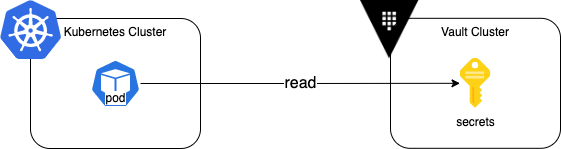
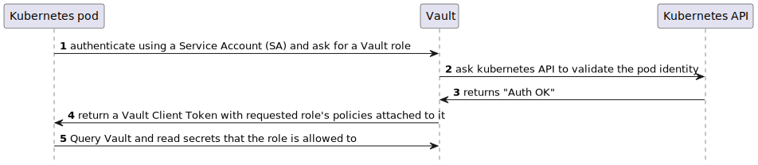

# Kubernetes with Vault integration patterns

This study shows how you can integrate HashiCorp Vault and Kubernetes to keep all your secrets in Vault, and access them from pods running on Kubernetes.

The recommended approach to access a secret is to use file-based secrets injection: after retrieving a secret from Vault, you write it to a file in a Container Volume that your application container will mount and use.

There is several decision points:

- How to interact with Vault: using the raw api, a programming library, Vault Agent, the Vault CSI Provider?
- How to authenticate with Vault, which Auth Method to choose?

## Running the demo

### Pre-requisites

You will need Minikube, Helm and Vault installed on your system. The demo has been validated with these versions:

- minikube 1.26.0
- Vault 1.11
- Helm 3.9.2

### Starting your local testing clusters

Run the init scripts:

- `> ./00_init_vault.sh`
- `> ./00_init_minikube.sh`

At this stage, you have a one-node Kubernetes cluster and a Vault server in dev mode running.

Run the configuration and deployment scripts in the `01_scripted_config` folder:

- `> ./1_configure.sh`
- `> ./2_deploy_initcontainer.sh`
- `> ./3_deploy_agentinjector.sh`

## How to interact with Vault

If you want to deeply integrate HashiCorp Vault into your application, using a [Vault API Client Library](https://www.vaultproject.io/api-docs/libraries) is probably the most native way to handle the problem. HashiCorp maintains the official Go and Ruby libraries, while the community provides library for C#, Java, Python and other languages. But using a client library will require you to change your application code, and each developer will need to maintain a deep understanding of the Vault API.

If you are using Kubernetes as a platform to run your application, you are probably looking to abstract such subjects from the application. With that in mind, Using the Vault Agent or the Vault CSI Provider are the recommended way to interact with HashiCorp Vault when you are running your application on Kubernetes.

We focus solely on the Vault Agent pattern using two different methods:

1. Vault Agent as an Init Container, for a first approach
2. Vault Agent as a Sidecar, using the [Vault Agent Sidecar Injector](https://www.vaultproject.io/docs/platform/k8s/injector) for more production ready deployments.

## How to be authenticated with Vault

Before accessing a secret stored in Vault, the client (a Kubernetes pod here) needs to authenticate with Vault. We will use the [Kubernetes Auth Method](https://www.vaultproject.io/docs/auth/kubernetes), which relies on a Kubernetes Service Account token as the reviewer JWT. More details [here](https://www.vaultproject.io/docs/auth/kubernetes#continue-using-long-lived-tokens).

The diagram below depicts the high-level authentication flow between Kubernetes and Vault.

*Note: Other Authentication Methods are valid options when integrating HashiCorp Vault with Kubernetes, such as using Kubernetes as an OIDC provider, but they are out of the scope of this study. You may consider it as an option if long-lived Service Account tokens are a concern in your particular context.*

## The challenges

Which element will execute the actions explained above, will you have to change your application to make it aware of Vault or not,

It currently supports two patterns:

1. 
2. 

Each pattern comes with its advantages, challenges, or shortcomings.
